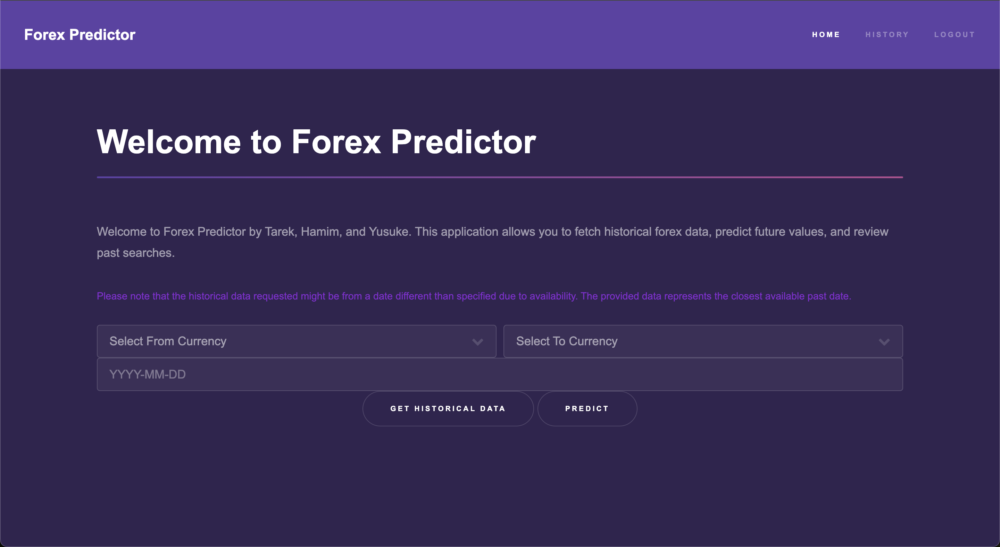
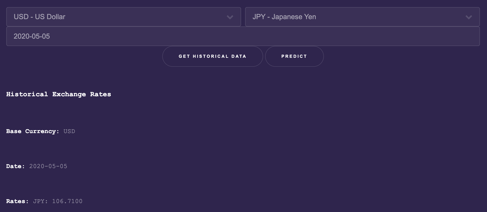
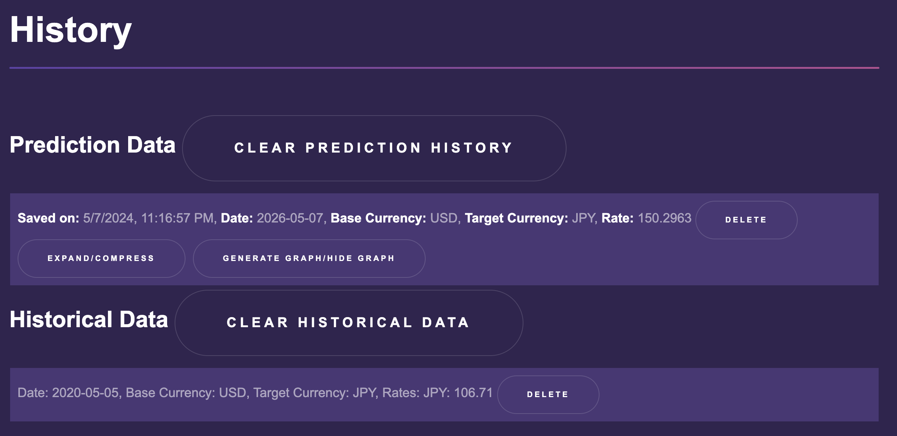

# ForEx Predictor


## Purpose
ForEx Predictor s aims to enhance decision-making for traders and businesses by offering predictive insights and actionable recommendations on currency exchange rate movements. This project, leveraging a microservices architecture with machine learning models and API integrations for real-time data, serves as a comprehensive tool for navigating the complexities of the foreign exchange market.

### Minimum Viable Product (MVP)
The application aims to deliver
- basic prediction service
- simple user interface
- capability of looking back at past searches done by a user

## Microservices Architecture

### Diagram


### UI Container
- **Responsibility:** Serves the frontend interface of CurrencyExchangeInsights, providing an intuitive and responsive user experience. It includes:
  - **Login Page**: Secure authentication for accessing user-specific insights and history.
  - **Home Page**: Central dashboard for currency predictions, real-time data viewing, and initiating new queries.
  - **History Page**: Displays a log of past queries and predictions, offering users insights into their past decisions.
  - **Profile Page**: Allows users to manage their account details and preferences.
- **Technologies:** Utilizes web technologies (HTML, CSS, JavaScript) for frontend development. The architecture supports SPA frameworks (e.g., React, Angular, Vue.js) for dynamic content delivery.

### Gateway API Service
- **Responsibility:** Acts as the central interface for user interactions, directing requests to the appropriate services. It serves the frontend, enabling users to view predictions, set alerts, and customize their experience.
- **Technologies:** Flask for the API; HTML/CSS/JavaScript for the frontend components.

### Prediction Service
- **Responsibility:** Employs LSTM (Long Short-Term Memory) networks for predicting future exchange rates based on historical data. Additionally, it generates and supplies graphical representations of predictions.
- **Technologies:** Python with TensorFlow or PyTorch for constructing and training machine learning models.

### Data Storage Service
- **Responsibility:** Handles storage and retrieval of historical data requests and prediction outcomes, supporting queries for historical information and managing user-generated history.
- **Technologies:** Python and Flask for creating RESTful services, SQLite for data persistence.

## Deployment
- **Containerization:** Docker is employed to containerize each microservice, ensuring isolated environments and dependency management.
- **Orchestration:** Kubernetes orchestrates the deployment, scaling, and management of containerized services, with Helm charts facilitating deployment configurations.

## Workflow
1. **User Interaction:** The Gateway API Service facilitates user requests for predictions, alerts, and system interactions through the frontend.
2. **Prediction Execution:** Continual model training within the Prediction Service enables the provision of updated exchange rate predictions and visualizations.
3. **Data Handling:** Historical and predictive data management is centralized within the Data Storage Service, ensuring dynamic and interactive content availability.

## Project Rubric Compliance

### Modular Services
- Showcases a microservices-based architecture with a clear division of responsibilities.

### Machine Learning/AI
- Applies sophisticated machine learning techniques for precise forecasting within the Prediction Service.

### Containers and Kubernetes
- Demonstrates cloud-native development and deployment best practices through the use of containerization and Kubernetes orchestration.

## Getting Started with Forex Predictor

This section provides detailed instructions on deploying and running the Forex Predictor application using Docker and Kubernetes. Ensure you have Docker, kubectl, and minikube (or any other Kubernetes cluster) installed on your system to proceed with the setup.

### Prerequisites
1. **Docker**: Install Docker on your system to create containers for each service.
2. **Kubernetes**: Install a Kubernetes cluster management tool, such as Minikube or use a cloud provider's Kubernetes service.
3. **kubectl**: Install kubectl to interact with your Kubernetes cluster.
4. **gCloud CLI**: Install gCloud CLI to connect to GKE clusters
5. **Helm**: Optionally, install Helm to manage Kubernetes charts easily.

### Deploying Forex Predictor
Follow these steps to deploy the Forex Predictor application on Kubernetes:

1. **Start Your Kubernetes Cluster**:

   - For Minikube: Run `minikube start` to initiate a local Kubernetes cluster.
  
  
2. **Clone the Repository**:
   - Clone this repository to your local machine to access the Kubernetes configuration files.
   ```bash
   git clone https://github.com/tarek-debug/Forex-Predictor.git
   ```
   ```bash
   cd forex-predictor
   ```

3. **Load Docker Images**: Replace Dockerhub username with yours.
   - Build Docker images for each service or pull them from your registry.
   ```bash
   docker build -t [DockerHub Username]/fxp-ui-image:v0.0.1 ./pages
   ```
   ```bash
   docker build -t [DockerHub Username]/forex-gateway:v0.0.1 ./gateway
   ```
   ```bash
   docker build -t [DockerHub Username]forex-prediction:v0.0.1 ./prediction
   ```
   ```bash
   docker build -t [DockerHub Username]forex-data-storage:v0.0.1 ./data_storage
   ```

4. **Create Namespace and Deploy Services to Kubernetes**: Make sure to change to rename the image container names to the ones you built in your dockerhub account.

   ```bash
   cd apps
   ```
   ```bash
   kubectl create namespace fxp-apps
   ```
   1. apply all yaml files in the folder:
   ```bash
   kubectl apply -f . -n fxp-apps
   ```
   2. Or, if you prefer each one individually:
   ```bash
   kubectl apply -f configmap.yaml -n fxp-apps
   ```
   ```bash
   kubectl apply -f data-storage-deployment.yaml -n fxp-apps
   ```
   ```bash
   kubectl apply -f data-storage-service.yaml -n fxp-apps
   ```
   ```bash
   kubectl apply -f gateway-deployment.yaml -n fxp-apps
   ```
   ```bash
   kubectl apply -f gateway-service.yaml -n fxp-apps
   ```
   ```bash
   kubectl apply -f prediction-deployment.yaml -n fxp-apps
   ```
   ```bash
   kubectl apply -f prediction-service.yaml -n fxp-apps
   ```
   ```bash
   kubectl apply -f ui-deployment.yaml -n fxp-apps
   ```
   ```bash
   kubectl apply -f ui-service.yaml -n fxp-apps
   ```
   ```bash
   kubectl apply -f fxp-ui-ingress.yaml -n fxp-apps
   ```


5. **Access the Application**:
   - Use `minikube service list` to find the IP and port of the UI service or check your cloud Kubernetes service dashboard.
   - Access the Forex Predictor UI via the provided URL in your browser.

### Monitoring and Logs
- Monitor the status of the pods and services using:
  ```bash
  kubectl get pods
  ```
  ```bash
  kubectl get services
   ```
- View logs for a specific service:
  ```bash
  kubectl logs <pod-name>
  ```
## Accessing the Application

### Access the UI Service through external ip

To access the `fxp-ui` service locally, you can easily navigate to `localhost` if your Kubernetes environment, such as Minikube or Docker Desktop, sets up the LoadBalancer service to use `localhost` as the EXTERNAL-IP. Here are the specific commands to check and access the service:

1. **Check the Service Details**:
   Use the following `kubectl` command to retrieve details about the `fxp-ui` service, including the EXTERNAL-IP and PORT(S):
   ```bash
   kubectl get service fxp-ui -n fxp-apps
This will provide output similar to:
```bash
NAME     TYPE           CLUSTER-IP      EXTERNAL-IP   PORT(S)        AGE
fxp-ui   LoadBalancer   10.108.27.125   localhost     80:30562/TCP   4m54s

```
1. **Open your web browser.**
2. **Enter the URL ( in our case, it is localhost) in the address bar:**
   ```plaintext
   http://localhost
### Access the UI Service through portforwarding
```bash
kubectl port-forward svc/fxp-ui 8080:80 -n fxp-apps
```
```bash
kubectl port-forward svc/fxp-gateway 8081:80 -n fxp-apps
```
```bash
kubectl port-forward svc/fxp-prediction 8082:80 -n fxp-apps
```
```bash
kubectl port-forward svc/fxp-data-storage 8083:80 -n fxp-apps
```
### Updating the Application
- To update any service, rebuild the Docker image and update the Kubernetes deployment:
  ```bash
  docker build -t forex-service:new ./path/to/service/Dockerfile
  ```
  ```bash
  kubectl set image deployment/forex-service forex-service=forex-service:new
   ```

### Cleaning Up
- To stop and remove all running services:
  ```bash
  kubectl delete all --all
  ```

This setup provides a robust foundation for running the Forex Predictor application in a production-like environment on Kubernetes.

### Usage Instructions
Once the UI is up and running and you are able to see the login page, first register for an account and sign in. Once you login, you should see the following screen↓



From here you are able to predict future exchange rates of two currencies. Make when you enter the date for both the prediction and historical data you put it in the format of YYYY-MM-DD where the months and dates include a 0 if the number is a single digit. As an example here is a picture of a prediction for the USD and JPY for May 7th, 2026↓


You will be provided with a graph and you are able to hover over the points to see the exact exchange rate of a given date between the day you set to predict and the day you predicted (aka today.) 
Historical data is similar↓



You should be able to see the base currency, the date, and the rate.
Over in the top right-hand corner you should see a logout button and to the left, a history button. That will take you to the history page of all the historical and predictive data you have looked up.



As seen in the screenshot the prediction and the historical data that has been looked up for the examples above are shown. If you click expand/compress you are able to check out the individual points predicted which are by day. You are also able to generate graph/hide graph to see the graph that has appeared when you predicted in the home page. For both prediction data and historical data you are able to delete your past searches individually or clear them all at once by clicking on clear prediction history or clear historical data.

### Dependencies
Languages - CSS, Python, JavaScript, HTML
Frameworks and Libraries - Flask, TensorFlow, Docker, Kubernetes

### Project Team Members
Hamim, Tarek, Yusuke

## Contributing
We encourage contributions to ForEx Predictor. See our contributing guidelines for more details on participating.

## License
This project is licensed under the MIT License. Refer to the LICENSE file for details.

## Acknowledgments
Components and inspiration were drawn from these repositories:
- User Authentication: [Flask User Authentication](https://github.com/anuraagnagar/flask-user-authentication/tree/main)
- Frankfurter API: [Frankfurter](https://github.com/hakanensari/frankfurter)
